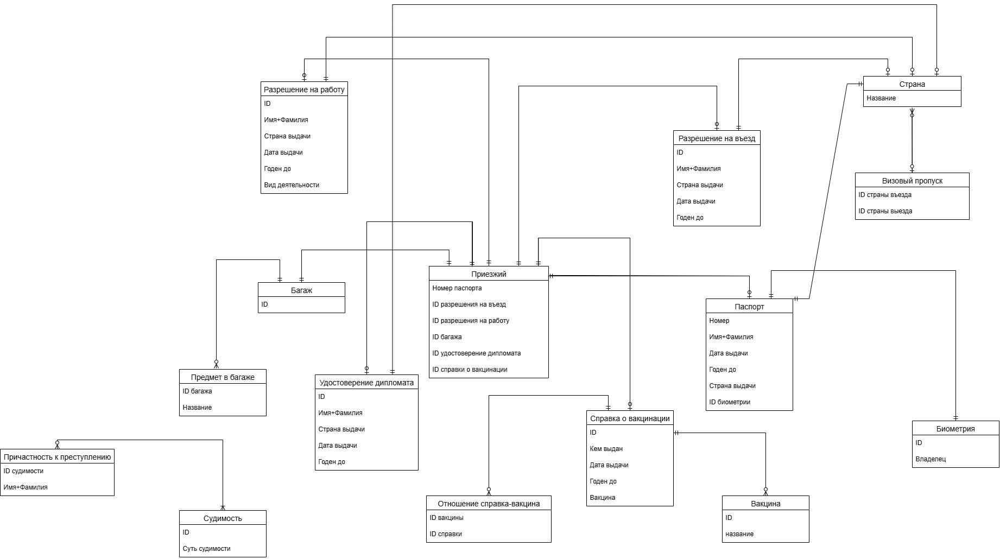
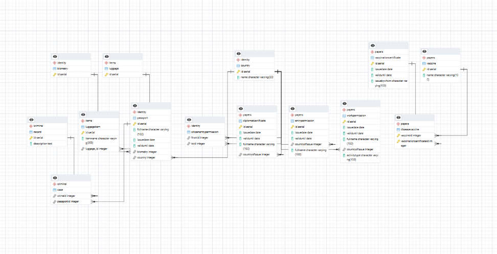

<h2> Название: Papers Plase</h2>

База данных помогает регулировать пограничный контроль: она систематизирует и хранит персональные данные, документы и информацию о багаже лиц, пересекающих государственную границу. Она позволяет эффективно выявлять и блокировать въезд лиц с запретом на въезд, подозреваемых в преступлениях, пытающихся ввезти запрещённые товары и т.д., обеспечивая безопасность страны и соблюдение иммиграционного законодательства.

---
### ER-модель таможенного контроля

---

### Скриншот структуры таблиц в СУБД 

