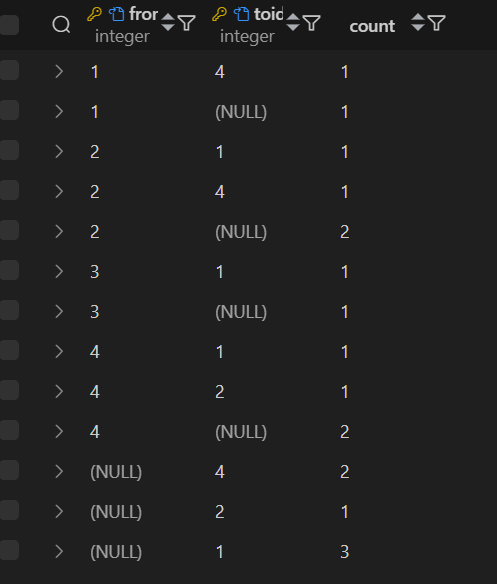
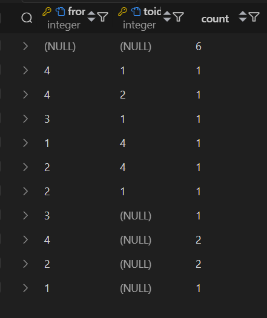
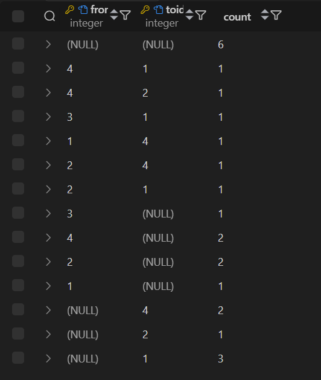

1. COUNT()

1.1 Получить количество стран, жители которых могут приехать в Россию
```sql
SELECT COUNT(*) 
FROM identity.citizenEntryPermission
WHERE toId = 1;
```


2. SUM()

2.1 Получить сумму Id всех стран, жители которых могут приехать в Россию
```sql
SELECT SUM(fromId)
FROM identity.citizenEntryPermission
WHERE toId = 1;
```


3. AVG()

3.1 Получить среднее Id всех стран, жители которых могут приехать в Китай
```sql
SELECT AVG(fromId)
FROM identity.citizenEntryPermission
WHERE toId = 4;
```


4. MIN()

4.1 Получить дату выпуска самого старого паспорта
```sql
SELECT MIN(issueDate)
FROM identity.passport;
```


5. MAX()

5.1 Получить дату, к которой у всех паспортов истечёт срок годности
```sql
SELECT MAX(validUntil)
FROM identity.passport;
```


6. STRING_AGG()

6.1 Получить названия всех стран, жители которых могут въезжать в Россию
```sql
SELECT STRING_AGG(country.name, ', ') as names
FROM identity.citizenEntryPermission
JOIN identity.country on country.id = citizenEntryPermission.fromId
WHERE toId = 1;
```


7. GROUP BY

7.1 Получить количество паспортов из каждой страны (только те, у которых кол-во больше 0)
```sql
SELECT country, COUNT(*) as num
FROM identity.passport
GROUP BY country;
```


8. HAVING

8.1 Получить количество паспортов из каждой страны, кроме Китая (только те, у которых кол-во больше 0)
```sql
SELECT country, COUNT(*) as num
FROM identity.passport
GROUP BY country
HAVING country <> 4;
```


9. GROUPING SETS

9.1 Количество разрешений откуда и куда, самостоятельных и объединенных по стране откуда или куда
```sql
SELECT fromId, toId, COUNT(*)
FROM identity.citizenEntryPermission
GROUP BY GROUPING SETS ((fromId, toId), (fromId), (toId));
```



10. ROLLUP

10.1 Количество разрешений откуда и куда, сначала самостоятельных, потом объединенных по стране откуда
```sql
SELECT fromId, toId, COUNT(*)
FROM identity.citizenEntryPermission
GROUP BY ROLLUP (fromId, toId);
```



11. CUBE

11.1 Количество разрешений откуда и куда, самостоятельных, объединенных по стране откуда или куда, и общее кол-во
```sql
SELECT fromId, toId, COUNT(*)
FROM identity.citizenEntryPermission
GROUP BY CUBE (fromId, toId);
```



12. SELECT + FROM + WHERE + GROUP BY + HAVING + ORDER BY

12.1 Получить количество паспортов из каждой страны, кроме Китая (только те, у которых кол-во больше 0).
Учитываются только паспорта, имена владельцев которых имеют Д в имени. Список сортируются по id страны.
```sql
SELECT country, COUNT(*) as num
FROM identity.passport
WHERE fullname LIKE '%Д%'
GROUP BY country
HAVING country <> 4
ORDER BY country;
```
