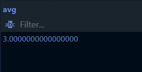
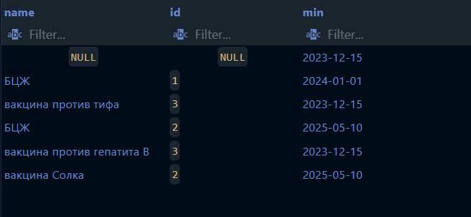
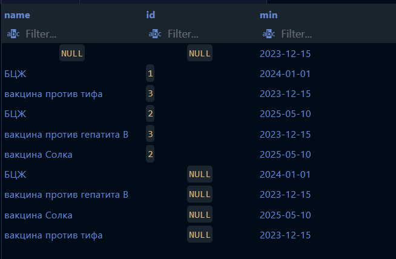
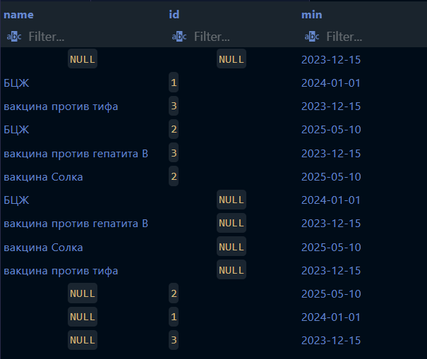

1. COUNT()

1.1 Получить количество стран, жители которых могут приехать в Россию
```sql
SELECT COUNT(*) 
FROM identity.citizenEntryPermission
WHERE toId = 1;
```


1.2 Получить количество вещей в багаже с id = 1
```sql
SELECT COUNT(*) FROM items.luggageitem
WHERE luggage_id = 1;
```


2. SUM()

2.1 Получить сумму Id всех стран, жители которых могут приехать в Россию
```sql
SELECT SUM(fromId)
FROM identity.citizenEntryPermission
WHERE toId = 1;
```


2.2 Получить сумму id всех криминальных записей, где описание состоит более, чем из одного слова
```sql
SELECT SUM(id) 
FROM criminal.record
WHERE description LIKE '%_ _%';
```


3. AVG()

3.1 Получить среднее Id всех стран, жители которых могут приехать в Китай
```sql
SELECT AVG(fromId)
FROM identity.citizenEntryPermission
WHERE toId = 4;
```


3.2 Получить среднее значение id дипломатических сертификатов, выданных Россией или США
```sql
SELECT AVG(d.id) 
FROM papers.diplomatcertificate d
INNER JOIN identity.country c ON d.countryofissue = c.id
WHERE c.name IN ('Россия', 'США');
```



4. MIN()

4.1 Получить дату выпуска самого старого паспорта
```sql
SELECT MIN(issueDate)
FROM identity.passport;
```


4.2 Получить самую раннюю дату истечения срока действия среди всех вакцинационных сертификатов
```sql
SELECT MIN(validUntil) FROM papers.vaccinationcertificate;
```


5. MAX()

5.1 Получить дату, к которой у всех паспортов истечёт срок годности
```sql
SELECT MAX(validUntil)
FROM identity.passport;
```


5.2 Получить максимальный id среди всех разрешений на работу
```sql
SELECT MAX(id) FROM papers.workpermission;
```


6. STRING_AGG()

6.1 Получить названия всех стран, жители которых могут въезжать в Россию
```sql
SELECT STRING_AGG(country.name, ', ') as names
FROM identity.citizenEntryPermission
JOIN identity.country on country.id = citizenEntryPermission.fromId
WHERE toId = 1;
```


6.2 Получить список названий вещей из багажа с id от 1 до 5
```sql
SELECT STRING_AGG(itemName, '; ') FROM items.luggageitem
WHERE luggage_id BETWEEN 1 AND 5;
```


7. GROUP BY

7.1 Получить количество паспортов из каждой страны (только те, у которых кол-во больше 0)
```sql
SELECT country, COUNT(*) as num
FROM identity.passport
GROUP BY country;
```


7.2 Получить список багажа с перечнем вещей в каждом
```sql
SELECT v.issueByWhom, STRING_AGG(vac.name, ', ')
FROM papers.vaccinationcertificate v
INNER JOIN  papers.diseasevaccine d
ON v.id = d.vaccinationcertificateid
INNER JOIN papers.vaccine vac
ON d.vaccineid = vac.id
GROUP BY v.issuebywhom;
```


8. HAVING

8.1 Получить количество паспортов из каждой страны, кроме Китая (только те, у которых кол-во больше 0)
```sql
SELECT country, COUNT(*) as num
FROM identity.passport
GROUP BY country
HAVING country <> 4;
```


8.2 Получить только тот багаж, который содержит более одной вещи
```sql
SELECT l.id, STRING_AGG(li.itemname, ', ')
FROM items.luggage l
INNER JOIN items.luggageitem li
ON l.id = li.luggage_id 
GROUP BY l.id
HAVING COUNT(li.id) > 1;
```


9. GROUPING SETS

9.1 Количество разрешений откуда и куда, самостоятельных и объединенных по стране откуда или куда
```sql
SELECT fromId, toId, COUNT(*)
FROM identity.citizenEntryPermission
GROUP BY GROUPING SETS ((fromId, toId), (fromId), (toId));
```


9.2 Получить минимальную дату выдачи сертификатов по вакцинам и сертификатам, а также общее минимальное значение
```sql
SELECT v.name, vc.id, MIN(vc.issueDate)
FROM papers.vaccine v
INNER JOIN papers.diseasevaccine dv
ON v.id = dv.vaccineid
INNER JOIN papers.vaccinationcertificate vc
ON dv.vaccinationcertificateid = vc.id
GROUP BY GROUPING SETS ((v.name, vc.id), ());
```



10. ROLLUP

10.1 Количество разрешений откуда и куда, сначала самостоятельных, потом объединенных по стране откуда
```sql
SELECT fromId, toId, COUNT(*)
FROM identity.citizenEntryPermission
GROUP BY ROLLUP (fromId, toId);
```


10.2 Получить самую раннюю зарегестрированный сертефикат по:
вакцинам и сертификатам

вакцинам

среди всех вакцин:
```sql
SELECT v.name, vc.id, MIN(vc.issueDate)
FROM papers.vaccine v
INNER JOIN papers.diseasevaccine dv
ON v.id = dv.vaccineid
INNER JOIN papers.vaccinationcertificate vc
ON dv.vaccinationcertificateid = vc.id
GROUP BY ROLLUP (v.name, vc.id);
```



11. CUBE

11.1 Количество разрешений откуда и куда, самостоятельных, объединенных по стране откуда или куда, и общее кол-во
```sql
SELECT fromId, toId, COUNT(*)
FROM identity.citizenEntryPermission
GROUP BY CUBE (fromId, toId);
```


11.2 Получить все возможные комбинации статистики по вакцинам и сертификатам
```sql
SELECT v.name, vc.id, MIN(vc.issueDate)
FROM papers.vaccine v
INNER JOIN papers.diseasevaccine dv
ON v.id = dv.vaccineid
INNER JOIN papers.vaccinationcertificate vc
ON dv.vaccinationcertificateid = vc.id
GROUP BY CUBE (v.name, vc.id);
```



12. SELECT + FROM + WHERE + GROUP BY + HAVING + ORDER BY

12.1 Получить количество паспортов из каждой страны, кроме Китая (только те, у которых кол-во больше 0).
Учитываются только паспорта, имена владельцев которых имеют Д в имени. Список сортируются по id страны.
```sql
SELECT country, COUNT(*) as num
FROM identity.passport
WHERE fullname LIKE '%Д%'
GROUP BY country
HAVING country <> 4
ORDER BY country;
```


12.2 Получить количество дипломатических разрешений на въезд по странам с фильтрацией и сортировкой
```sql
SELECT c.name, COUNT(e.id) AS diplomat_count
FROM identity.country c
LEFT JOIN papers.entrypermission e
ON c.id = e.countryofissue
WHERE c.name IN ('Германия', 'Испания', 'Россия', 'Китай', 'США')
GROUP BY c.name
HAVING COUNT(e.id) > 0
ORDER BY COUNT(e.id) DESC;
```
