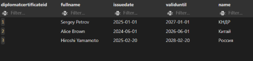
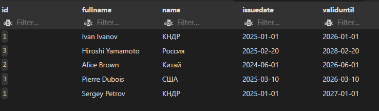
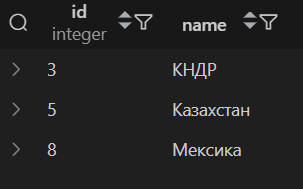
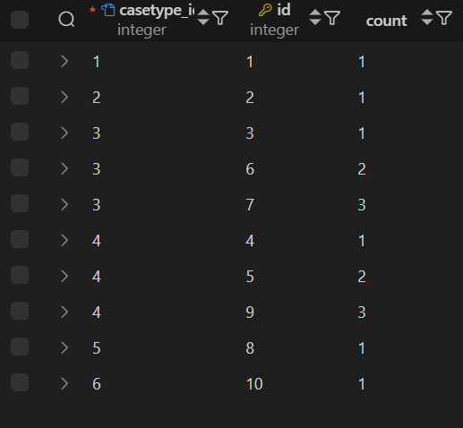
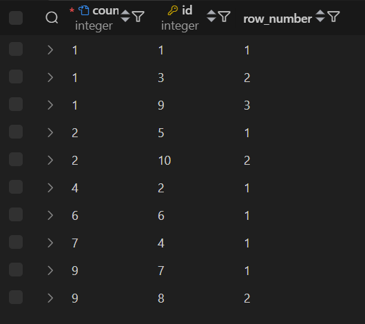
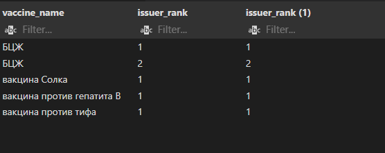

1. CTE

1.1. Получение количества преступлений у преступников
```sql
with criminals as
    (select biometryid, count(crimeid) as crimeCount
        from criminal.record
        group by biometryid)

select fullname, crimeCount
from criminals
join identity.passport on biometry = criminals.biometryid;
```


1.2. Альтернативное получение всех предметов через временную таблицу
```sql
with uselessItems as
    (select itemname
     from items.luggageitemtype)

select uselessItems from uselessItems;
```


1.3 Получить имена пользователей, которым можно въезжать в Россию
```sql
with allowedCountries as (
    select fromId as id
    from identity.citizenEntryPermission
    where toId = 1
)
select fullName
from identity.passport
where country in (select id from allowedCountries);
```


1.4 Получить справку дипломата и страну
```sql
WITH diplomatCerteficateWithCountry AS 
    (SELECT dc.id AS diplomatcertificateId, dc.fullname, dc.issuedate, dc.validuntil, c.name 
    FROM papers.diplomatcertificate dc
    INNER JOIN identity.country c
    ON dc.countryofissue = c.id
    WHERE validuntil > CURRENT_DATE)

SELECT * FROM diplomatCerteficateWithCountry;
```


1.5 Получить разрешение на работу со страной
```sql
WITH workPermissionWithCountry AS 
    (SELECT * FROM papers.workpermission wp
    INNER JOIN identity.country c
    ON wp.countryofissue = c.id)

SELECT fullname, name FROM workPermissionWithCountry
WHERE validuntil > CURRENT_DATE;
```


2. UNION, INTERSECT, EXCEPT запросики :3

2.1. Union

2.1.1. Объединение всех типов преступлений и предметов в одну таблицу
```sql
select *
from criminal.casetype
union 
select *
from items.luggageitemtype;
```


2.1.2. Получить все страны, где больше 1 проживающего, и Китай
```sql
SELECT *
FROM identity.country
WHERE name = 'Китай'
UNION
SELECT *
FROM identity.country c
WHERE (SELECT count(*) FROM identity.passport p where p.country = c.id) > 1
ORDER BY id;
```


2.1.3 Получить объединение записей из разрешения на работу и дипломатического разрешения
```sql
SELECT w.id, w.fullname, c.name, w.issuedate, w.validuntil 
FROM papers.workpermission w
JOIN identity.country c
ON w.countryofissue = c.id
WHERE w.validuntil > CURRENT_DATE
UNION
SELECT dc.id, dc.fullname, c.name, dc.issuedate, dc.validuntil 
FROM papers.diplomatcertificate dc
JOIN identity.country c
ON dc.countryofissue = c.id
WHERE dc.validuntil > CURRENT_DATE;
```


2.2. Intersect

2.2.1. Получение всех преступлений из массива и фильтрация их по другой таблице
```sql
select *
from criminal.casetype
where id in (1, 3)
intersect
select *
from criminal.casetype
where id = 3;
```


2.2.2. Получить все страны, где больше 1 проживающего, у которых название из 5 букв
```sql
SELECT *
FROM identity.country
WHERE length(name) = 5
INTERSECT
SELECT *
FROM identity.country c
WHERE (SELECT count(*) FROM identity.passport p where p.country = c.id) > 1
ORDER BY id;
```


2.2.3 Получить записи, которые есть в дипломатическом разрешении и разрешении на въезд
```sql
SELECT e.fullname, e.issuedate, e.validuntil 
FROM papers.entrypermission e
INTERSECT
SELECT dc.fullName, dc.issuedate, dc.validuntil
FROM papers.diplomatcertificate dc;
```


2.3. Except

2.3.1. Получение всех типов преступлений кроме тех, у которых id между 3 и 6
```sql
select *
from criminal.casetype
except 
select *
from criminal.casetype
where id between 3 and 6;
```


2.3.2. Получить все страны, где никто не живёт
```sql
SELECT *
FROM identity.country
EXCEPT
SELECT *
FROM identity.country
WHERE id IN (
    SELECT distinct country FROM identity.passport
)
ORDER BY id;
```


2.3.3 Получить записи, которые есть в дипломатическом разрешении, но которых нет в разрешении на въезд
```sql
SELECT e.fullname, e.issuedate, e.validuntil 
FROM papers.entrypermission e
EXCEPT
SELECT dc.fullName, dc.issuedate, dc.validuntil
FROM papers.diplomatcertificate dc;
```


3. Partition by

3.1. Выборка всех типов преступлений по Id и количество совершенных случаев этих преступлений
```sql
select distinct 
    casetype_id,
    count (*) over (partition by casetype_id)
from criminal.case;
```


3.2. Кол-во дипломатов и одной страны
```sql
SELECT DISTINCT
    c.name AS country_name,
    COUNT(*) OVER(PARTITION BY d.countryofissue) AS diplomate_count
FROM papers.diplomatcertificate d
JOIN identity.country c
ON d.countryofissue = c.id;
```


4. Partition by + order by

4.1. Плавный подсчёт количество паспортов из каждой страны
```sql
select distinct 
    country,
    id,
    count (*) over (partition by country order by id)
from identity.passport
order by country, id;
```


4.2. Получить место, где поставили вакцину и номер этой вакцины 
```sql
WITH serteficateAndVaccine AS
    (SELECT v.id AS vaccineId, vc.issueByWhom, v.name AS vaccineName
    FROM papers.vaccinationcertificate vc
    JOIN papers.diseasevaccine dv
    ON vc.id = dv.vaccinationcertificateid
    JOIN papers.vaccine v
    ON dv.vaccineid = v.id)

SELECT 
    vaccineId,
    issueByWhom,
    ROW_NUMBER() OVER (PARTITION BY issueByWhom ORDER BY vaccineId) AS vaccine_count
FROM serteficateAndVaccine
```


5. Rows and range

5.1. Получение всех случаев преступлений и значения равному сумму типов преступлений в двух столбцах до этого и этого столбца
```sql
select 
    id,
    sum (casetype_id) over (rows between 2 preceding and current row )
from criminal.case;
```

5.2. Для каждой страны для каждого паспорта средний id из id этого паспорта и id предыдущего
```sql
select 
    country,
    id,
    avg (id) over (partition by country order by id rows between 1 preceding and current row)
from identity.passport
order by country, id;
```


6. Ранжирующие функции

6.1. Для каждого паспорта - его номер среди других паспортов из той же страны
```sql
select 
    country,
    id,
    row_number () over (partition by country order by id)
from identity.passport
order by country, id;
```


6.2. Получить два вида ранда для ID вакцины
```sql
SELECT 
    v.name AS vaccine_name,
    RANK() OVER (PARTITION BY v.id ORDER BY vc.issuebywhom) AS issuer_rank,
    DENSE_RANK() OVER (PARTITION BY v.id ORDER BY vc.issuebywhom) AS issuer_rank
FROM papers.vaccine v
JOIN papers.diseasevaccine dv
ON v.id = dv.vaccineid
JOIN papers.vaccinationcertificate vc
ON dv.vaccinationcertificateid = vc.id;
```


6.3 Получить "твердый" ранг Id при партиции по casetype_id
```sql
select distinct 
    casetype_id,
    dense_rank() over (partition by casetype_id order by id)
from criminal."case"
order by casetype_id;
```


7. Функции смещения

7.1. Получение первого номера случая по какому то типу преступлений
```sql
select distinct 
    casetype_id,
    first_value(id) over (partition by casetype_id order by id)
from criminal.case;
```


7.2. Получение чела с наибольшим id для каждой страны
```sql
select 
    country,
    id,
    last_value (id) over (partition by country order by id rows between current row and unbounded following)
from identity.passport
order by country, id;
```


7.3. Получить смещение имени работника на 1 назад и на 1 вперед
```sql
SELECT
    a.description AS activity_type,
    wp.fullname,
    LAG(wp.fullname) OVER (ORDER BY wp.id) AS lag,
    LEAD(wp.fullname) OVER (ORDER BY wp.id) AS Lead
FROM papers.workpermission wp
JOIN papers.activity a
ON wp.activityid = a.id;
```

