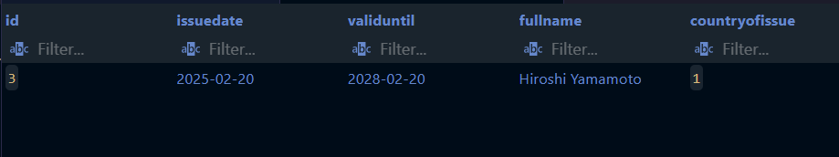
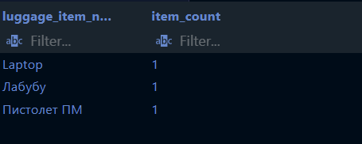
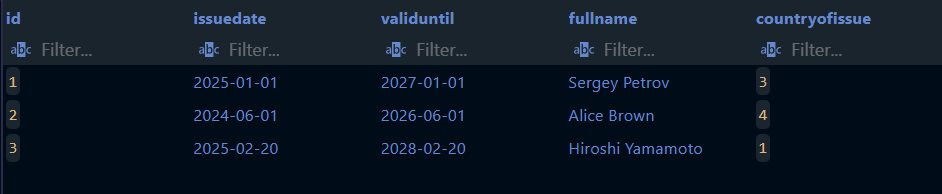
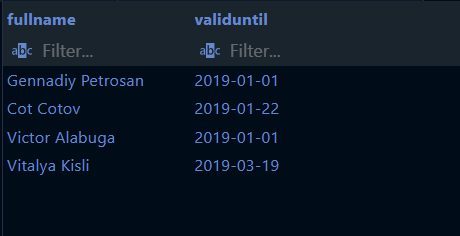

1. SELECT()

1.1 Получить данные сертефиката пользователя с наибольшей датой выпуска
```sql
SELECT * FROM papers.diplomatcertificate d
WHERE d.issuedate = 
(SELECT MAX(d2.issuedate) FROM papers.diplomatcertificate d2);
```


1.2 Получить название первой страны (но более странным способом)
```sql
SELECT (SELECT name FROM identity.country LIMIT 1) AS name;
```


1.3 Получить тип предмета багажа с самым длинным названием
```sql
SELECT * FROM items.luggageitemtype it
WHERE length(it.itemname) = (SELECT MAX(length(it2.itemname)) FROM items.luggageitemtype it2);
```


2. FROM()

2.1 Получить кол-во каждого предметов, существующих в багаже 
```sql
SELECT subquery.luggage_item_name, subquery.item_count
FROM (SELECT li.id as luggage_item_id, li.itemname AS luggage_item_name, COUNT(li.luggage_id) as item_count
      FROM items.luggageItem li
      GROUP BY li.id) as subquery
WHERE subquery.item_count >= 1;
```


2.2 Получить паспорта пользователей, чьё ФИО больше 10 букв и у которых есть биометрия
```sql
SELECT *
FROM (
    SELECT *
    FROM identity.passport
    WHERE LENGTH(fullname) > 10
) as users
WHERE users.biometry IS NOT NULL;
```


2.3 Получить название последнего типа предмета багажа по ID
```sql
SELECT (SELECT itemName FROM items.luggageitemtype Order by id desc LIMIT 1) AS name;
```


3. WHERE()

3.1 Получить разрешение на работу с ближайшим сроком истечения его действительности
```sql
SELECT wp.fullName, wp.validUntil 
FROM papers.workpermission wp 
WHERE wp.validUntil = 
(SELECT MIN(wp2.validUntil) 
 FROM papers.workpermission wp2 
 WHERE wp2.validUntil > CURRENT_DATE);
```


3.2 Получить самый новый паспорт
```sql
SELECT * FROM identity.passport p
WHERE p.issuedate = (
    SELECT MAX(p2.issuedate)
    FROM identity.passport p2
);
```


3.3 Получить ID биометрий, которые встречаются более чем в одном криминальном деле
```sql
SELECT subquery.biometryid
FROM (SELECT biometryid, count(crimeid) as crimes
      from criminal.record
      group by biometryid) as subquery
WHERE crimes > 1;
```


4. HAVING()

4.1 Получить страну и его кол-во при наличии разрешения на въезд с этой страной с неистекшим сроком действительности
```sql
SELECT country, COUNT(*) as num
FROM identity.passport
GROUP BY country
HAVING country IN (SELECT DISTINCT countryOfIssue 
                  FROM papers.entrypermission
                  WHERE validUntil > CURRENT_DATE);
```


4.2 Получить количество паспортов из каждой страны, кроме тех, у которых id больше, чем у США
```sql
SELECT country, COUNT(*) as num
FROM identity.passport
GROUP BY country
HAVING country <= (
    SELECT id FROM identity.country WHERE name = 'США'
);
```

4.3 Получить криминальные дела с количеством участников больше одного
```sql
SELECT crimeid, COUNT(biometryid) as people
FROM criminal.record
GROUP BY crimeid
HAVING crimeid IN (SELECT crimeid
                      FROM (SELECT crimeid, count(biometryid) as crimes
                            from criminal.record
                            group by crimeid) as subquery
                      WHERE crimes > 1);
```


5. ALL()

5.1 Получить вакцины хоть раз упомянутые в справках о вакцинации
```sql
SELECT v.name
FROM papers.vaccine v
WHERE v.id = ANY (
    SELECT DISTINCT dv.vaccineId 
    FROM papers.diseaseVaccine dv
);
```


5.2 Получить все страны, где не живёт Гаррье Дюбуа, но живёт хоть кто-то
```sql
SELECT *
FROM identity.country c
WHERE (
    SELECT DISTINCT id
    FROM identity.passport
    WHERE name = 'Гаррье Дюбуа' 
) <> ALL (
    SELECT DISTINCT id
    FROM identity.passport p
    WHERE p.country = c.id
);
```


5.3 Проверить, больше ли число 2 всех значений биометрии в криминальных записях
```sql
SELECT 2 > ALL(SELECT distinct biometryid from criminal.record);
```


6. IN()

6.1 Получить паспорта (с именем гражданина и датой выпуска) страны, куда можно попасть из CША
```sql
SELECT fullName, issueDate
FROM identity.passport
WHERE country IN (
    SELECT toId 
    FROM identity.citizenEntryPermission 
    WHERE fromId = (SELECT id FROM identity.country WHERE name = 'США')
);
```


6.2 Получить те страны, откуда есть паспорта
```sql
SELECT *
FROM identity.country
WHERE id IN (
    SELECT DISTINCT country FROM identity.passport
);
```


6.3 Получить криминальные дела с количеством участников больше одного (альтернативный вариант)
```sql
SELECT crimeid, COUNT(biometryid) as people
FROM criminal.record
GROUP BY crimeid
HAVING crimeid IN (SELECT crimeid
                   FROM (SELECT crimeid, count(biometryid) as crimes
                         from criminal.record
                         group by crimeid) as subquery
                   WHERE crimes > 1);
```


7. ANY()

7.1 Получить разрешения на работу, дата выпуска которых меньше любой даты выпуска всех сертефикатов дипломатов
```sql
SELECT wp.fullName, wp.validUntil
FROM papers.workPermission wp
WHERE wp.validUntil < ANY (
    SELECT validUntil 
    FROM papers.diplomatCertificate
);
```


7.2 Получить те страны, откуда есть паспорта
```sql
SELECT *
FROM identity.country
WHERE id = ANY (
    SELECT country FROM identity.passport
);
```


7.3 Проверить, больше ли число 3 любого значения биометрии в криминальных записях
```sql
select 3 > ANY(SELECT distinct biometryid from criminal.record);
```


8. EXIST()

8.1 Получить граждан (их паспорта), у которых есть криминальная история 
```sql
SELECT p.fullName, p.id as passport_id
FROM identity.passport p
WHERE EXISTS (
    SELECT 1 
    FROM Criminal.case c 
    WHERE c.passportid = p.id
);
```


8.2 Получить те страны, откуда есть паспорта
```sql
SELECT *
FROM identity.country c
WHERE EXISTS (
    SELECT 1 
    FROM identity.passport p
    WHERE c.id = p.country
);
```


8.3 Получить криминальные записи, где biometryid равен 1 или 2
```sql
SELECT *
FROM criminal.record
WHERE EXISTS (
    SELECT 1
    FROM (VALUES (1), (2)) AS allowed_ids(id)
    WHERE allowed_ids.id = criminal.record.biometryid
);
```


9. Сравнение по нескольким столбцам

9.1 Получить фальшивые сертификаты дипломатов: те, которых нет в соответствующих паспортах
```sql
SELECT * FROM papers.diplomatcertificate d
WHERE (d.fullname, d.countryOfIssue) NOT IN (
    SELECT c.fullName, c.country
    FROM identity.passport c
);
```


9.3 Получить криминальные записи с конкретными комбинациями crimeid и biometryid
```sql
SELECT * FROM criminal.record
WHERE (crimeid, biometryid) in ((1, 2),(2, 3));
```


## Коррелированные подзапросы

1. Получить паспорта, у которых есть действующие разрешения на работу

```sql
SELECT p.fullName, p.issueDate, p.validUntil
FROM identity.passport p
WHERE EXISTS (
    SELECT 1 
    FROM papers.workPermission wp
    WHERE wp.fullName = p.fullName
      AND wp.validUntil > CURRENT_DATE
      AND wp.countryOfIssue = p.country
);
```


2. Получить граждан (их паспорта), у которых есть криминальная история 
```sql
SELECT p.fullName, p.id as passport_id
FROM identity.passport p
WHERE EXISTS (
    SELECT 1 
    FROM Criminal.case c 
    WHERE c.passportid = p.id
);
```


3. Получить количество криминальных дел для каждого пасспорта

```sql
SELECT 
    p.fullName,
    p.biometry,
    (SELECT COUNT(*) 
     FROM Criminal.case cr 
     WHERE cr.passportId = p.id) as crime_count
FROM identity.passport p
WHERE p.biometry IS NOT NULL;
```


4. Получить багажи, в которых есть предметы 

```sql
SELECT l.id
FROM Items.Luggage l
WHERE EXISTS (
    SELECT 1 
    FROM Items.LuggageItem li 
    WHERE li.luggage_id = l.id
);
```


5.  Найти паспорта с истекшим сроком действия, у которых есть связанная биометрия

```sql
SELECT p.fullName, p.validUntil
FROM identity.passport p
WHERE p.validUntil < CURRENT_DATE
  AND EXISTS (
    SELECT 1 
    FROM identity.biometry b 
    WHERE b.id = p.biometry
);
```


