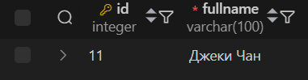
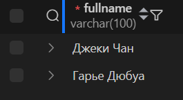

1. Выборка всех данных из таблицы

1.1 Получить список всех стран (Id + Название)
```sql
SELECT * FROM identity.country;
```


1.2 Получить все данные таблицы криминальных случаев
```sql
SELECT * FROM criminal."case";
```


2. Выборка отдельных столбцов

2.1 Получить названия всех стран
```sql
SELECT name FROM identity.country;
```


2.2 Получить название всех типов предметов
```sql
select itemName from items.LuggageItemType;
```


3. Присвоение новых имен столбцам при формировании выборки

3.1 Получить из списка паспортов все имена приезжих с их страной
```sql
SELECT fullname, country as from
FROM identity.passport;
```


3.2 Получить из списка предметов и подставить заголовок "Название предмета" в колонку
```sql
select itemName as "Название предмета" from items.LuggageItemType;
```


4. Выборка данных с созданием вычисляемого столбца

4.1 Получить из списка паспортов все имена приезжих с данными о валидности паспорта
```sql
SELECT fullName,
    validUntil > CURRENT_DATE AS is_valid
FROM identity.passport;
```


4.2 Получить таблицу преступлений и вычисляемым столбцом с Id > 2
```sql
select description, id > 2 as Id_BiggerThenTwo from Criminal.CaseType;
```


5. Выборка данных, вычисляемые столбцы, математические функции

5.1 Получить из списка паспортов все имена приезжих с квадратным корнем идентификатора (зачем? неважно)
```sql
SELECT fullName, sqrt(id) as square_root 
FROM identity.passport;
```


5.2 Получить все криминальные случаи и их Id помноженным на число Pi
```sql
select description, id * pi() as "Id and pi" from Criminal.CaseType;
```


6. Выборка данных, вычисляемые столбцы, логические функции

6.1 Получить из списка паспортов все имена приезжих, помеченные как просроченные, если паспорт недействителен, иначе как действительные
```sql
SELECT fullName,
CASE
    WHEN validUntil > CURRENT_DATE
    THEN '[действительно]'
    ELSE '[просрочено]'
END AS validTag
FROM identity.passport;
```


6.2 Получить все предметы и проставить какие из них на английском
```sql
select itemName,
       case
           when itemName ~ '^[A-Za-z]+$'
               then '[Английский]'
           else '[Русский]'
           end
           as Is_English
from items.LuggageItemType;
```


7. Выборка данных по условию

7.1 Получить паспорт пользователя с именем 'Джеки Чан'
```sql
SELECT *
FROM identity.passport
WHERE fullName = 'Джеки Чан';
```


7.2 Получить все предметы с русскими названиями
```sql
select itemName
from items.luggageitemtype
where not(itemname ~ '^[A-Za-z]+$');
```


8. Выборка данных, логические операции

8.1 Получить паспорта пользователей, чьё ФИО больше 10 букв и у которых есть биометрия
```sql
SELECT *
FROM identity.passport
WHERE LENGTH(fullname) > 10 AND biometry IS NOT NULL;
```


8.2 Получить описания всех предметов у которых длина слова большье 30 и Id > 2
```sql
select description
from criminal.casetype
where length(description) < 30 and id > 2;
```


9. Выборка данных, оператор BETWEEN

9.1 Получить ФИО и ID пользователей с паспортами, чьё ФИО длиной от 3 до 10 букв
```sql
SELECT id, fullname
FROM identity.passport
WHERE LENGTH(fullname) BETWEEN 3 AND 10;
```


9.2 Получить описание всех преступлений с названием от 20 до 40 символов
```sql
select description
from criminal.casetype
where length(description) between 20 and 40;
```


10. Выборка данных, оператор IN

10.1 Получить ФИО и ID пользователей с паспортами из Китая(4) и России(1)
```sql
SELECT id, fullname, country
FROM identity.passport
WHERE country IN (1, 4);
```


10.2 Получить все преступления Id которых на 1 и не 3
```sql
select description
from criminal.casetype
where id not in (1, 3);
```


11. Выборка данных с сортировкой

11.1 Получить ФИО пользователей с паспортами в лексикографическом порядке
```sql
SELECT fullname
FROM identity.passport
ORDER BY fullname;
```


11.2 Получить все преступления в обратном порядке по Id
```sql
select description
from criminal.casetype
order by id desc;
```


12. Выборка данных, оператор LIKE

12.1 Получить ФИО пользователей с паспортами, у которых в ФИО присутствует буква Д
```sql
SELECT fullname
FROM identity.passport
WHERE fullname LIKE '%Д%';
```


12.2 Получить названия всех предметов у которых в названии два слова
```sql
select itemName
from items.luggageitemtype
where itemname like '_% _%';
```


13. Выбор уникальных элементов столбца

13.1 Получить ID стран, куда можно въезжать иностранцам
```sql
SELECT DISTINCT toId
FROM identity.citizenEntryPermission;
```


13.2 Получить уникальные названия всех предметов у которых в названии два слова 
```sql
select distinct itemName
from items.luggageitemtype
where itemname like '_% _%';
```


14. Выбор ограниченного количества возвращаемых строк.

14.1 Получить какую-то одну страну, в которые можно въезжать гражданам США
```sql
SELECT DISTINCT toId
FROM identity.citizenEntryPermission
WHERE fromID = 2
LIMIT 1;
```


14.2 Получить две случайные строки с предметами
```sql
select itemName
from items.luggageitemtype
order by random()
limit 2;
```


15. Соединение INNER JOIN

15.1 Получить ФИО пользователей с паспортами вместе с названиями стран, откуда они
```sql
SELECT p.fullname, c.name
FROM identity.passport p
INNER JOIN identity.country c ON p.country = c.id;
```


15.2 Соединить две таблицы с криминальными случаями и преступлениями
```sql
select "case".id, description
from criminal."case" join criminal.casetype c on "case".casetype_id = c.id;
```


16. Внешнее соединение LEFT OUTER JOIN

16.1 Получить список пользователей и, при наличии удостоверения дипломата, дату истечения его срока
```sql
SELECT p.fullname, d.validUntil
FROM identity.passport p
LEFT JOIN papers.diplomatCertificate d ON p.fullName = d.fullName;
```


16.2 Получить имена преступников и их преступления
```sql
select fullname, description
from identity.passport left join identity.biometry b on b.id = passport.biometry
left join criminal.record r on b.id = r.biometryid
left join criminal."case" c on r.crimeid = c.id
left join criminal.casetype c2 on c.casetype_id = c2.id;
```


17. Внешнее соединение RIGHT OUTER JOIN

17.1 Получить все удостоверения дипломата и, при наличии данных, дату истечения срока действия паспортов дипломатов
```sql
SELECT d.fullname, p.validUntil
FROM identity.passport p
RIGHT JOIN papers.diplomatCertificate d ON p.fullName = d.fullName;
```


17.2 Получить все преступления и сопоставить к ним людей
```sql
select fullname, description
from identity.passport right join identity.biometry b on b.id = passport.biometry
                       right join criminal.record r on b.id = r.biometryid
                       right join criminal."case" c on r.crimeid = c.id
                       right join criminal.casetype c2 on c.casetype_id = c2.id;
```


18. Перекрестное соединение CROSS JOIN

18.1 Получить все возможные пары стран (ограничиться 10-ю)
```sql
SELECT c1.name, c2.name
FROM identity.country c1, identity.country c2
LIMIT 10;
```


18.2 Переженить всех
```sql
select distinct p1.fullname as "Муж", p2.fullname as "Жена"
from identity.passport p1, identity.passport p2
```


19. Запросы на выборку из нескольких таблиц

19.1 Получить все записи о том, из какой страны в какую можно въезжать, но вместо ID их названия
```sql
SELECT c1.name as from, c2.name as to
FROM identity.citizenEntryPermission perm
INNER JOIN identity.country c1 ON perm.fromId = c1.id
INNER JOIN identity.country c2 ON perm.toId = c2.id;
```


19.2 Получить все преступления и сопоставить к ним людей
```sql
select fullname, description
from identity.passport right join identity.biometry b on b.id = passport.biometry
                       right join criminal.record r on b.id = r.biometryid
                       right join criminal."case" c on r.crimeid = c.id
                       right join criminal.casetype c2 on c.casetype_id = c2.id;
```

