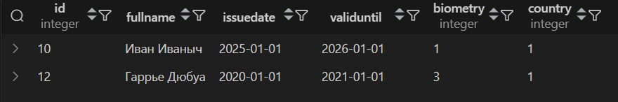
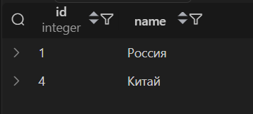
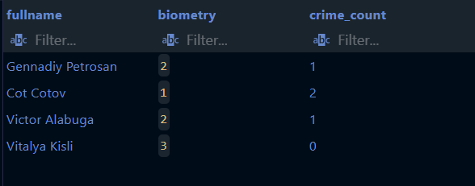

1. SELECT()

1.1 Получить данные сертефиката пользователя с наибольшей датой выпуска
```sql
SELECT * FROM papers.diplomatcertificate d
WHERE d.issuedate = 
(SELECT MAX(d2.issuedate) FROM papers.diplomatcertificate d2);
```


1.2 Получить название первой страны (но более странным способом)
```sql
SELECT (SELECT name FROM identity.country LIMIT 1) AS name;
```


2. FROM()

2.1 Получить кол-во каждого предметов, существующих в багаже 
```sql
SELECT subquery.luggage_item_name, subquery.item_count
FROM (SELECT li.id as luggage_item_id, li.itemname AS luggage_item_name, COUNT(li.luggage_id) as item_count
      FROM items.luggageItem li
      GROUP BY li.id) as subquery
WHERE subquery.item_count >= 1;
```


2.2 Получить паспорта пользователей, чьё ФИО больше 10 букв и у которых есть биометрия
```sql
SELECT *
FROM (
    SELECT *
    FROM identity.passport
    WHERE LENGTH(fullname) > 10
) as users
WHERE users.biometry IS NOT NULL;
```


3. WHERE()

3.1 Получить разрешение на работу с ближайшим сроком истечения его действительности
```sql
SELECT wp.fullName, wp.validUntil 
FROM papers.workpermission wp 
WHERE wp.validUntil = 
(SELECT MIN(wp2.validUntil) 
 FROM papers.workpermission wp2 
 WHERE wp2.validUntil > CURRENT_DATE);
```


3.2 Получить самый новый паспорт
```sql
SELECT * FROM identity.passport p
WHERE p.issuedate = (
    SELECT MAX(p2.issuedate)
    FROM identity.passport p2
);
```


4. HAVING()

4.1 Получить страну и его кол-во при наличии разрешения на въезд с этой страной с неистекшим сроком действительности
```sql
SELECT country, COUNT(*) as num
FROM identity.passport
GROUP BY country
HAVING country IN (SELECT DISTINCT countryOfIssue 
                  FROM papers.entrypermission
                  WHERE validUntil > CURRENT_DATE);
```


4.2 Получить количество паспортов из каждой страны, кроме тех, у которых id больше, чем у США
```sql
SELECT country, COUNT(*) as num
FROM identity.passport
GROUP BY country
HAVING country <= (
    SELECT id FROM identity.country WHERE name = 'США'
);
```


5. ALL()

5.1 Получить вакцины хоть раз упомянутые в справках о вакцинации
```sql
SELECT v.name
FROM papers.vaccine v
WHERE v.id = ANY (
    SELECT DISTINCT dv.vaccineId 
    FROM papers.diseaseVaccine dv
);
```


5.2 Получить все страны, где не живёт Гаррье Дюбуа, но живёт хоть кто-то
```sql
SELECT *
FROM identity.country c
WHERE (
    SELECT DISTINCT id
    FROM identity.passport
    WHERE name = 'Гаррье Дюбуа' 
) <> ALL (
    SELECT DISTINCT id
    FROM identity.passport p
    WHERE p.country = c.id
);
```


6. IN()

6.1 Получить паспорта (с именем гражданина и датой выпуска) страны, куда можно попасть из CША
```sql
SELECT fullName, issueDate
FROM identity.passport
WHERE country IN (
    SELECT toId 
    FROM identity.citizenEntryPermission 
    WHERE fromId = (SELECT id FROM identity.country WHERE name = 'США')
);
```


6.2 Получить те страны, откуда есть паспорта
```sql
SELECT *
FROM identity.country
WHERE id IN (
    SELECT DISTINCT country FROM identity.passport
);
```


7. ANY()

7.1 Получить разрешения на работу, дата выпуска которых меньше любой даты выпуска всех сертефикатов дипломатов
```sql
SELECT wp.fullName, wp.validUntil
FROM papers.workPermission wp
WHERE wp.validUntil < ANY (
    SELECT validUntil 
    FROM papers.diplomatCertificate
);
```


7.2 Получить те страны, откуда есть паспорта
```sql
SELECT *
FROM identity.country
WHERE id = ANY (
    SELECT country FROM identity.passport
);
```


8. EXIST()

8.1 Получить граждан (их паспорта), у которых есть криминальная история 
```sql
SELECT p.fullName, p.id as passport_id
FROM identity.passport p
WHERE EXISTS (
    SELECT 1 
    FROM Criminal.case c 
    WHERE c.passportid = p.id
);
```


8.2 Получить те страны, откуда есть паспорта
```sql
SELECT *
FROM identity.country c
WHERE EXISTS (
    SELECT 1 
    FROM identity.passport p
    WHERE c.id = p.country
);
```


9. Сравнение по нескольким столбцам

9.1 Получить фальшивые сертификаты дипломатов: те, которых нет в соответствующих паспортах
```sql
SELECT * FROM papers.diplomatcertificate d
WHERE (d.fullname, d.countryOfIssue) NOT IN (
    SELECT c.fullName, c.country
    FROM identity.passport c
);
```


## Коррелированные подзапросы

1. Получить паспорта, у которых есть действующие разрешения на работу

```sql
SELECT p.fullName, p.issueDate, p.validUntil
FROM identity.passport p
WHERE EXISTS (
    SELECT 1 
    FROM papers.workPermission wp
    WHERE wp.fullName = p.fullName
      AND wp.validUntil > CURRENT_DATE
      AND wp.countryOfIssue = p.country
);
```


2. Получить граждан (их паспорта), у которых есть криминальная история 
```sql
SELECT p.fullName, p.id as passport_id
FROM identity.passport p
WHERE EXISTS (
    SELECT 1 
    FROM Criminal.case c 
    WHERE c.passportid = p.id
);
```



3. Получить количество криминальных дел для каждого пасспорта

```sql
SELECT 
    p.fullName,
    p.biometry,
    (SELECT COUNT(*) 
     FROM Criminal.case cr 
     WHERE cr.passportId = p.id) as crime_count
FROM identity.passport p
WHERE p.biometry IS NOT NULL;
```


4. Получить багажи, в которых есть предметы 

```sql
SELECT l.id
FROM Items.Luggage l
WHERE EXISTS (
    SELECT 1 
    FROM Items.LuggageItem li 
    WHERE li.luggage_id = l.id
);
```


5.  Найти паспорта с истекшим сроком действия, у которых есть связанная биометрия

```sql
SELECT p.fullName, p.validUntil
FROM identity.passport p
WHERE p.validUntil < CURRENT_DATE
  AND EXISTS (
    SELECT 1 
    FROM identity.biometry b 
    WHERE b.id = p.biometry
);
```

