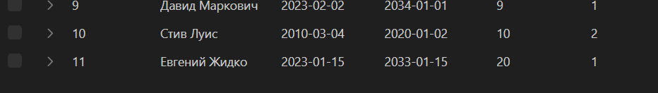
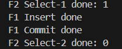
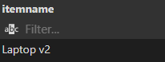
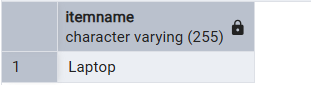
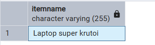
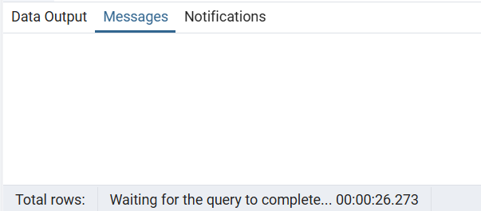
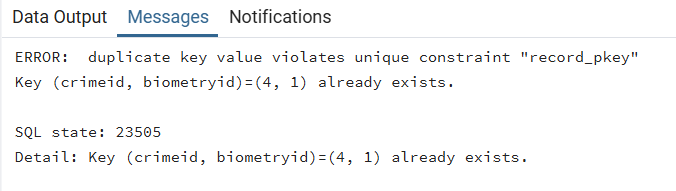
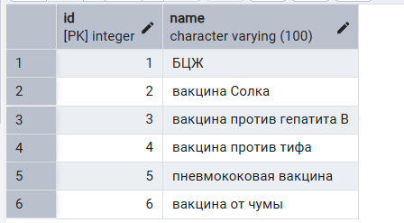
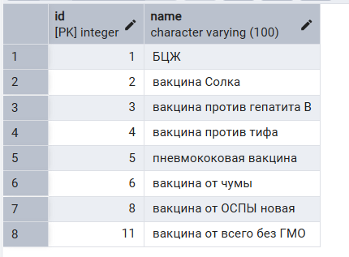

## Базовые транзакции

1. COMMIT

1.1. Добавление нового пользователя, а потом присвоение ему новой биометрии
```sql
BEGIN;

INSERT INTO identity.passport (
    fullName,
    issueDate,
    validUntil,
    biometry,
    country
) VALUES (
     'Евгений Жидко',
    '2023-01-15',
    '2033-01-15',
    1,
    1
)

WITH new_biometry AS (
    INSERT INTO identity.biometry DEFAULT VALUES
    RETURNING id
)
UPDATE identity.passport
SET 
    biometry = new_biometry.id
FROM new_biometry
WHERE fullName = 'Евгений Жидко';

COMMIT;
```

1.2 Использование тразакции:
```sql
begin;
select * from items.luggageitem;
with new_item as (
    insert into items.luggageitemtype (itemname) values ('Плюшевая игрушка')
    returning id
)

update items.luggageitem set itemtype_id = (select id from new_item limit 1) where id = 3;
select * from items.luggageitem;
commit;
```

2. ROLLBACK

2.1. Добавление нового пользователя, а потом присвоение ему новой биометрии (ROLLBACK-версия)
```sql
BEGIN;

INSERT INTO identity.passport (
    fullName,
    issueDate,
    validUntil,
    biometry,
    country
) VALUES (
    'Евгений Жидко',
    '2023-01-15',
    '2033-01-15',
    1,
    1
)

WITH new_biometry AS (
    INSERT INTO identity.biometry DEFAULT VALUES
    RETURNING id
)
UPDATE identity.passport
SET 
    biometry = new_biometry.id
FROM new_biometry
WHERE fullName = 'Евгений Жидко';

ROLLBACK;
```
Изначально


До rollback


После rollback


2.1 То же самое но с rollback
```sql
begin;
with new_item as (
    insert into items.luggageitemtype (itemname) values ('Плюшевая игрушка')
    returning id
)

update items.luggageitem set itemtype_id = (select id from new_item limit 1) where id = 3;
select * from items.luggageitemtype;
rollback;
select * from items.luggageitemtype;
commit;
```

ДО:

ПОСЛЕ:


3. ERROR

3.1. Добавление нового пользователя с невозможным id
```sql

BEGIN;

INSERT INTO identity.passport (
    fullName,
    issueDate,
    validUntil,
    biometry,
    country
) VALUES (
    'Евгений Жидко',
    '2023-01-15',
    '2033-01-15',
    1,
    1 / 0
)

ROLLBACK;
```

3.2 Ошибка синтаксиса
```sql
begin;
with new_item as (
    insert into items.luggageitemtype (itemname) values ('Плюшевая игрушка')
    returning id
)

update items.luggageitem set itemtype_id = (selectm limit 1) where id = 3;
select * from items.luggageitemtype;
rollback;
select * from items.luggageitemtype;
commit;
```
ДО:

ПОСЛЕ:

ОШИБКА:


## Isolation levels

4. READ UNCOMMITTED / READ COMMITTED - Попытка прочитать грязные данные (неудачная)

4.1. Добавление нового пользователя и откат, между этим попытка его обнаружить
```csharp

using Npgsql;

string ConnectionString = "Host=localhost;Username=postgres;Password=;Database=PapersPlease";

bool canRead = false;
bool canRollBack = false;

var insert = Task.Run(async () =>
{
    await using var conn = new NpgsqlConnection(ConnectionString);
    await conn.OpenAsync();

    await using var transaction = await conn.BeginTransactionAsync(System.Data.IsolationLevel.ReadUncommitted);

    var sql =
    """
    INSERT INTO identity.passport (
        fullName,
        issueDate,
        validUntil,
        biometry,
        country
    ) VALUES (
        'Горбуша сырокопчёная',
        '2023-01-15',
        '2033-01-15',
        1,
        1
    )
    """;
    await using var cmd = new NpgsqlCommand(sql, conn, transaction);
    await cmd.ExecuteNonQueryAsync();
    Console.WriteLine("F1 Insert done");
    canRead = true;

    while (!canRollBack)
    {
        await Task.Delay(1000);
    }

    await transaction.RollbackAsync();
    Console.WriteLine("F1 Rollback done");
});

var read = Task.Run(async () =>
{
    while (!canRead)
    {
        await Task.Delay(1000);
    }

    await using var conn = new NpgsqlConnection(ConnectionString);
    await conn.OpenAsync();

    await using var transaction = await conn.BeginTransactionAsync(System.Data.IsolationLevel.ReadUncommitted);

    var sql =
    """
    SELECT COUNT(*)
    FROM identity.passport
    WHERE fullName = 'Горбуша сырокопчёная';
    """;
    await using var cmd = new NpgsqlCommand(sql, conn, transaction);
    var res = await cmd.ExecuteScalarAsync();

    await transaction.CommitAsync();

    Console.WriteLine($"F2 Select done: {res}");
    canRollBack = true;
});

await Task.WhenAll(insert, read);
```


5. READ COMMITTED - Неповторяющееся чтение

5.1. Попытка считать количество пользователей до изменения и после

```csharp

using Npgsql;

string ConnectionString = "Host=localhost;Username=postgres;Password=;Database=PapersPlease";

bool canEdit = false;
bool canTryAgain = false;

var insert = Task.Run(async () =>
{
    await using var conn = new NpgsqlConnection(ConnectionString);
    await conn.OpenAsync();

    await using var transaction = await conn.BeginTransactionAsync(System.Data.IsolationLevel.ReadCommitted);

    var sql =
    """
    SELECT COUNT(*)
    FROM identity.passport
    WHERE fullName = 'Евгений Жидко';
    """;
    await using var cmd = new NpgsqlCommand(sql, conn, transaction);
    var res = await cmd.ExecuteScalarAsync();

    Console.WriteLine($"F2 Select-1 done: {res}");
    canEdit = true;

    while (!canTryAgain)
    {
        await Task.Delay(1000);
    }

    await using var cmd2 = new NpgsqlCommand(sql, conn, transaction);
    var res2 = await cmd.ExecuteScalarAsync();

    Console.WriteLine($"F2 Select-2 done: {res2}");

    await transaction.CommitAsync();
});

var read = Task.Run(async () =>
{
    while (!canEdit)
    {
        await Task.Delay(1000);
    }

    await using var conn = new NpgsqlConnection(ConnectionString);
    await conn.OpenAsync();

    await using var transaction = await conn.BeginTransactionAsync(System.Data.IsolationLevel.ReadCommitted);

    var sql =
    """
    UPDATE identity.passport
    SET
        fullName = 'Евгений Твёрдо'
    WHERE fullName = 'Евгений Жидко';
    """;
    await using var cmd = new NpgsqlCommand(sql, conn, transaction);
    await cmd.ExecuteNonQueryAsync();
    Console.WriteLine("F1 Insert done");

    await transaction.CommitAsync();
    Console.WriteLine("F1 Commit done");

    canTryAgain = true;
});

await Task.WhenAll(insert, read);
```




5.2. Попытка получить предмет из багажа с id=3 до и после

```sql
-- T1
BEGIN TRANSACTION ISOLATION LEVEL READ COMMITTED;

SELECT itemName FROM Items.LuggageItemType WHERE id = 3;

-- T2
BEGIN;
UPDATE Items.LuggageItemType
SET itemName = 'Laptop v2'
WHERE id = 3;

COMMIT;

-- T1
SELECT itemName FROM Items.LuggageItemType WHERE id = 3;

COMMIT;
```





6. REPEATABLE READ - Невидимые изменения

6.1. Попытка считать количество пользователей до изменения и после

Код как выше, только IsolationLevel.RepeatableRead


6.2. Попытка получить предмет из багажа с id=3 до и после

```sql
-- T1
BEGIN TRANSACTION ISOLATION LEVEL REPEATABLE READ;

SELECT itemName FROM Items.LuggageItemType WHERE id = 3;

-- T2
BEGIN;
UPDATE Items.LuggageItemType
SET itemName = 'Laptop super pro'
WHERE id = 3;

COMMIT;

-- T1
SELECT itemName FROM Items.LuggageItemType WHERE id = 3;

COMMIT;


-- new query
BEGIN TRANSACTION ISOLATION LEVEL REPEATABLE READ;
SELECT itemName FROM Items.LuggageItemType WHERE id = 3;
COMMIT;
```





7. REPEATABLE READ - Фантомное чтение

7.1. Попытка считать количество пользователей до добавления нового и после

```csharp

using Npgsql;

string ConnectionString = "Host=localhost;Username=postgres;Password=;Database=PapersPlease";

bool canEdit = false;
bool canTryAgain = false;

var insert = Task.Run(async () =>
{
    await using var conn = new NpgsqlConnection(ConnectionString);
    await conn.OpenAsync();

    await using var transaction = await conn.BeginTransactionAsync(System.Data.IsolationLevel.ReadCommitted);

    var sql =
    """
    SELECT COUNT(*)
    FROM identity.passport
    WHERE fullName = 'Горбуша сырокопчёная';
    """;
    await using var cmd = new NpgsqlCommand(sql, conn, transaction);
    var res = await cmd.ExecuteScalarAsync();

    Console.WriteLine($"F2 Select-1 done: {res}");
    canEdit = true;
    
    while (!canTryAgain)
    {
        await Task.Delay(1000);
    }

    await using var cmd2 = new NpgsqlCommand(sql, conn, transaction);
    var res2 = await cmd.ExecuteScalarAsync();

    Console.WriteLine($"F2 Select-2 done: {res2}");

    await transaction.CommitAsync();
});

var read = Task.Run(async () =>
{
    while (!canEdit)
    {
        await Task.Delay(1000);
    }

    await using var conn = new NpgsqlConnection(ConnectionString);
    await conn.OpenAsync();

    await using var transaction = await conn.BeginTransactionAsync(System.Data.IsolationLevel.ReadUncommitted);

    var sql =
    """
    INSERT INTO identity.passport (
        fullName,
        issueDate,
        validUntil,
        biometry,
        country
    ) VALUES (
        'Горбуша сырокопчёная',
        '2023-01-15',
        '2033-01-15',
        1,
        1
    )
    """;
    await using var cmd = new NpgsqlCommand(sql, conn, transaction);
    await cmd.ExecuteNonQueryAsync();
    Console.WriteLine("F1 Insert done");  

    await transaction.CommitAsync();
    Console.WriteLine("F1 Commit done");

    canTryAgain = true;
});

await Task.WhenAll(insert, read);
```


7.2. Попытка получить кол-во разрешений на работу до записи и после: запись заблокоровалась из-за того, что фантомы блокируются

```sql
-- T1
BEGIN TRANSACTION ISOLATION LEVEL REPEATABLE READ;

SELECT COUNT(*) 
FROM papers.workPermission;

-- T2
BEGIN;

INSERT INTO papers.workPermission (
        issueDate,
        validUntil,
        fullName,
        countryOfIssue,
        activityid
    )
VALUES (
        '2025-02-10',
        '2029-10-01',
        'Viktor Korneplod',
        2,
        1
    );

COMMIT;

-- T1
SELECT COUNT(*) 
FROM papers.workPermission;
-- снова N (фантом НЕ виден)
COMMIT;
```


8. SERIALIZABLE - Фантомное чтение

8.1 Попытка два раза обновить пользователя

```csharp

using Npgsql;

string ConnectionString = "Host=localhost;Username=postgres;Password=;Database=PapersPlease";

bool canStart = false;
bool canCommit = false;
bool canCommit2 = false;

var insert = Task.Run(async () =>
{
    try
    {
        await using var conn = new NpgsqlConnection(ConnectionString);
        await conn.OpenAsync();

        await using var transaction = await conn.BeginTransactionAsync(System.Data.IsolationLevel.Serializable);

        var sql =
        """
        UPDATE identity.passport
        SET
            fullName = 'Евгений Твёрдо'
        WHERE fullName = 'Евгений Жидко';
        """;
        await using var cmd = new NpgsqlCommand(sql, conn, transaction);
        await cmd.ExecuteNonQueryAsync();
        Console.WriteLine("F1 Update");

        canStart = true;

        while (!canCommit)
        {
            await Task.Delay(1000);
        }

        Console.WriteLine("T1 Commit");
        await transaction.CommitAsync();

        canCommit2 = true;
    }
    catch (Exception e)
    {
        Console.WriteLine(e.Message);
    }
});

var read = Task.Run(async () =>
{
    try
    {
        await using var conn = new NpgsqlConnection(ConnectionString);
        await conn.OpenAsync();

        await using var transaction = await conn.BeginTransactionAsync(System.Data.IsolationLevel.Serializable);

        while (!canStart)
        {
            await Task.Delay(1000);
        }

        var sql =
        """
        UPDATE identity.passport
        SET
            fullName = 'Евгений Твёрдо'
        WHERE fullName = 'Евгений Жидко';
        """;
        await using var cmd = new NpgsqlCommand(sql, conn, transaction);
        await cmd.ExecuteNonQueryAsync();
        Console.WriteLine("F2 Update");

        canCommit = true;

        while (!canCommit2)
        {
            await Task.Delay(1000);
        }

        await transaction.CommitAsync();
        Console.WriteLine("F2 Commit");
    }
    catch (Exception e)
    {
        Console.WriteLine(e.Message);
    }
});

await Task.WhenAll(insert, read);
```

Исполнение умирает как только начинается второй update
В консоли: F1 Update, и всё

8.2. попытка записать одинаковые PK в таблицу Record
```sql
-- преждевременное удаление записи
BEGIN TRANSACTION ISOLATION LEVEL SERIALIZABLE;
DELETE FROM Criminal.Record
WHERE crimeId = 4 AND biometryId = 1;
COMMIT;

-- T1
BEGIN TRANSACTION ISOLATION LEVEL SERIALIZABLE;

INSERT INTO Criminal.Record (crimeId, biometryId)
VALUES (4, 1);

-- T2
BEGIN TRANSACTION ISOLATION LEVEL SERIALIZABLE;

INSERT INTO Criminal.Record (crimeId, biometryId)
VALUES (4, 1);

-- T1
COMMIT;

--T2
COMMIT;
```


Затем СУБД ушел в зависание:
pgAdmin ничего не возвращал, но внизу шел таймер.



При разрешении одного у T2 появлялась ошибка:




9.1 Использование сохранения
```sql
begin;
savepoint aboba;
select * from items.luggageitem;
update items.luggageitem set itemtype_id = 3 where id = 2;
select * from items.luggageitem;
rollback to aboba;
```


9.2 Использование двух сохранений
```sql
begin;
savepoint aboba;
select * from items.luggageitem;
update items.luggageitem set itemtype_id = 3 where id = 2;
select * from items.luggageitem;
rollback to aboba;

savepoint abobus;
update items.luggageitem set itemtype_id = 3 where id = 1;
select * from items.luggageitem;
rollback to abobus;

insert into items.luggageitem (itemtype_id, luggage_id) values (6, 3);
select * from items.luggageitem;
commit;
```
первый селект:

второй:

третий:

четвертый:


10. Один SAVEPOINT

10. Запрос для добавления вакцины и ее обновление (вне зависимости от обновлениия вакцина должна быть добавлена)
```sql
BEGIN TRANSACTION ISOLATION LEVEL SERIALIZABLE;
SELECT * FROM papers.vaccine;
COMMIT;

BEGIN TRANSACTION ISOLATION LEVEL SERIALIZABLE;

INSERT INTO papers.vaccine (name)
VALUES ('вакцина от ОСПЫ новая');

SAVEPOINT before_insert;

UPDATE papers.vaccine
SET name = 'вакцина от ОСПЫ без ГМО новая'
WHERE id = 10;

ROLLBACK TO SAVEPOINT before_insert;

COMMIT;

BEGIN TRANSACTION ISOLATION LEVEL SERIALIZABLE;
SELECT * FROM papers.vaccine;
COMMIT;
```




как мы видим добавления произошло, а обновление - нет

11. несколько SAVEPOINT

11. Запрос для добавления вакцины, ее обновление и удаления (вне зависимости от удаления вакцина должна быть добавлена и обновлена)

```sql
BEGIN TRANSACTION ISOLATION LEVEL SERIALIZABLE;
SELECT * FROM papers.vaccine;
COMMIT;

BEGIN TRANSACTION ISOLATION LEVEL SERIALIZABLE;

INSERT INTO papers.vaccine (name)
VALUES ('вакцина от всего');

SAVEPOINT before_insert;

UPDATE papers.vaccine
SET name = 'вакцина от всего без ГМО'
WHERE id = 10;

SAVEPOINT before_update;

DELETE FROM papers.vaccine
WHERE name='вакцина от всего без ГМО';

ROLLBACK TO SAVEPOINT before_update;

COMMIT;

BEGIN TRANSACTION ISOLATION LEVEL SERIALIZABLE;
SELECT * FROM papers.vaccine;
COMMIT;
```




как мы видим, удаление не произошло