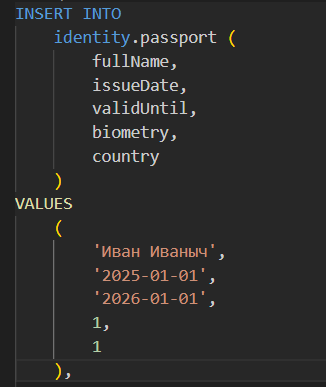
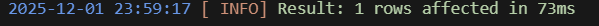
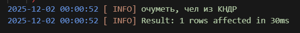
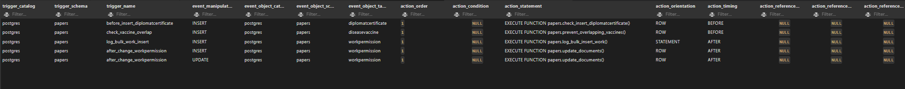
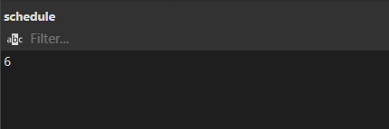
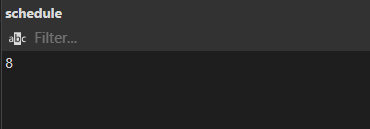
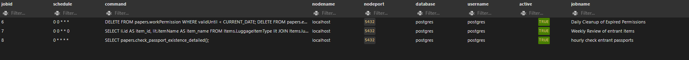

### Триггеры

1. NEW 

1.1 Выкидывать уведомление, если придёт чел из КНДР

```sql
CREATE OR REPLACE FUNCTION identity.notify_if_from_kndr()
RETURNS TRIGGER AS $$
BEGIN
    IF NEW.country = 3 THEN
        RAISE INFO 'очуметь, чел из КНДР';
    END IF;
    RETURN NEW;
END;
$$ LANGUAGE plpgsql;

CREATE TRIGGER before_insert_passport
    BEFORE INSERT OR UPDATE ON identity.passport
    FOR EACH ROW
    EXECUTE FUNCTION identity.notify_if_from_kndr();
```





1.2 Проверка имен предметов на длину
```sql
create or replace procedure CheckItemName(name varchar(200))
language plpgsql
as $$
begin
    case 
        when length(name)  >200  then raise info 'Как ты вообще смог это сделать';
        when length(name) between 100 and 199 then raise info 'Довольно длинное имя';
        when length(name) between 1 and 99 then raise info 'Обычное имя предмета';
    end case;
end;
$$;


create or replace function items.CheckItem()
returns trigger as $$
begin
    call CheckItemName(new.itemname);
    return new;
end;
$$ language plpgsql;

create or replace trigger commonItemTypeChecks
    before insert or update on items.luggageitemtype
    for each row 
    execute function items.CheckItem();

insert into items.luggageitemtype (itemname) values ('Очень крутой предмет');
insert into items.luggageitemtype (itemname) values ('Очень пупер улььтра мега супер дупер пупер ну просто офигенный круто прекрутой прям пипец какой крутой предмет'); 
```


2. OLD

2.1 Предотвратить изменение страны в паспорте

```sql
CREATE OR REPLACE FUNCTION identity.prevent_country_change()
RETURNS TRIGGER AS $$
BEGIN
    IF OLD.country <> NEW.country THEN
        RAISE EXCEPTION 'Изменение страны в паспорте запрещено! Заводи новый паспорт, придурок! Паспорт ID %', OLD.id;
    END IF;
    RETURN NEW;
END;
$$ LANGUAGE plpgsql;

CREATE TRIGGER before_country_change
    BEFORE UPDATE OF country ON identity.passport
    FOR EACH ROW
    EXECUTE FUNCTION identity.prevent_country_change();
```
2.2 Проверка на изменение имени предмета
```sql
create or replace function items.CheckItemBefore()
returns trigger as $$
begin
    if old.itemname = new.itemname then
        raise exception 'Бро, ты имя то не поменял';
    end if;
end;
$$ language plpgsql;

create or replace trigger beforeItemUpdate
    before update of itemname on items.luggageitemtype
    for each row
    execute function items.CheckItemBefore();

update items.luggageitemtype
set itemname = 'Пистолет ПМ'
where id = 1;
```


3. BEFORE

3.1.  Триггер для валидации дат при добавлении сертефиката дипломата
```sql
CREATE OR REPLACE FUNCTION papers.check_insert_diplomatcertificate()
RETURNS TRIGGER AS $$
BEGIN
    IF NEW.validuntil < NOW() THEN
        RAISE EXCEPTION 'validUntil cannot be in the past';
    END IF;

    IF NEW.issuedate > NOW() THEN
        RAISE EXCEPTION 'issueDate cannot be in the future';
    END IF;

    RETURN NEW;
END;
$$ language plpgsql;

CREATE TRIGGER before_insert_diplomatcertificate
BEFORE INSERT ON papers.diplomatcertificate
FOR EACH ROW
EXECUTE FUNCTION papers.check_insert_diplomatcertificate();
```

```sql
INSERT INTO papers.diplomatCertificate (
        issueDate,
        validUntil,
        fullName,
        countryOfIssue
    )
VALUES (
        '2026-01-01',
        '2030-01-01',
        'Wrong Person',
        2
    )
```


3.2 Проверка на изменение имени предмета
```sql
create or replace function items.CheckItemBefore()
returns trigger as $$
begin
    if old.itemname = new.itemname then
        raise exception 'Бро, ты имя то не поменял';
    end if;
end;
$$ language plpgsql;

create or replace trigger beforeItemUpdate
    before update of itemname on items.luggageitemtype
    for each row
    execute function items.CheckItemBefore();

update items.luggageitemtype
set itemname = 'Пистолет ПМ'
where id = 1;
```


4. AFTER

4.1. Триггер для обновления соответствующих данных для въезда пользовалеля при обновлении разрешения на работу
```sql
CREATE OR REPLACE FUNCTION papers.update_documents()
RETURNS TRIGGER AS $$
BEGIN
    UPDATE papers.entryPermission
    SET countryOfIssue = NEW.countryOfIssue,
        validUntil = NEW.validUntil,
        issueDate = NEW.issueDate
    WHERE fullName = NEW.fullName;

    RETURN NEW;
END;
$$ language plpgsql;


CREATE TRIGGER after_change_workPermission
AFTER INSERT OR UPDATE ON papers.workPermission
FOR EACH ROW
EXECUTE FUNCTION papers.update_documents();
```

```sql
INSERT INTO papers.workPermission (
        issueDate,
        validUntil,
        fullName,
        countryOfIssue,
        activityid
    )
VALUES (
        '2025-03-01',
        '2030-09-01',
        'Sam Altman',
        1,
        2
    );
```


4.2 Проверка на изменение имени, вот только поздно уже
```sql
create or replace function items.CheckItemBefore()
returns trigger as $$
begin
    if old.itemname != new.itemname then
        raise exception 'Бро, ты имя то поменял';
    end if;
    return new;
end;
$$ language plpgsql;

create or replace trigger beforeItemUpdate
    after update of itemname on items.luggageitemtype
    for each row
    execute function items.CheckItemBefore();

update items.luggageitemtype
set itemname = 'Пистолет П'
where id = 1;
```


5. Row level

5.1. Триггер для проеверки того, что у сертефикаата вакцины не будет одинаковых вакцин
```sql
CREATE OR REPLACE FUNCTION papers.prevent_overlapping_vaccines()
RETURNS TRIGGER AS $$
BEGIN
    IF EXISTS (
        SELECT 1
        FROM papers.diseaseVaccine dv
        JOIN papers.vaccinationCertificate vc
            ON vc.id = dv.vaccinationCertificateId
        WHERE dv.vaccineId = NEW.vaccineId
          AND vc.validUntil >= CURRENT_DATE
    ) THEN
        RAISE EXCEPTION 'A valid vaccination certificate for this vaccine already exists.';
    END IF;

    RETURN NEW;
END;
$$ LANGUAGE plpgsql;

CREATE TRIGGER check_vaccine_overlap
BEFORE INSERT ON papers.diseaseVaccine
FOR EACH ROW
EXECUTE FUNCTION papers.prevent_overlapping_vaccines();
```

```sql
INSERT INTO papers.diseasevaccine (
        vaccineId,
        vaccinationCertificateId
    )
VALUES (1, 1);
```
5.2 Проверка на изменение имени предмета
```sql
create or replace function items.CheckItemBefore()
returns trigger as $$
begin
    if old.itemname = new.itemname then
        raise exception 'Бро, ты имя то не поменял';
    end if;
end;
$$ language plpgsql;

create or replace trigger beforeItemUpdate
    before update of itemname on items.luggageitemtype
    for each row
    execute function items.CheckItemBefore();

update items.luggageitemtype
set itemname = 'Пистолет ПМ'
where id = 1;
```


6. Statement level

6.1. Логгирование массовых изменений в workPermission
```sql
CREATE OR REPLACE FUNCTION papers.log_bulk_insert_work()
RETURNS TRIGGER AS $$
BEGIN
    INSERT INTO papers.audit_log (description)
    VALUES ('Bulk INSERT into workPermission table');
    RETURN NULL;
END;
$$ LANGUAGE plpgsql;

CREATE TRIGGER log_bulk_work_insert
AFTER INSERT ON papers.workPermission
FOR EACH STATEMENT
EXECUTE FUNCTION papers.log_bulk_insert_work();
```

```sql
INSERT INTO papers.workPermission (
        issueDate,
        validUntil,
        fullName,
        countryOfIssue,
        activityid
    )
VALUES (
        '2025-03-01',
        '2030-09-01',
        'Sam Altman',
        1,
        2
    );
```


6.2


7. Отображение списка триггеров

```sql
SELECT *
FROM information_schema.triggers;
```



### Кроны

8. Кроны

3.1. Ежедневная очистка таблиц с разрешениями на работу и въезд
```sql
SELECT cron.schedule(
    'Daily Cleanup of Expired Permissions',
    '0 0 * * *',
    $$
    DELETE FROM papers.workPermission WHERE validUntil < CURRENT_DATE;
      DELETE FROM papers.entryPermission WHERE validUntil < CURRENT_DATE;
    $$
);
```


3.2. Еженедельный обзор предметов приезжающих людей

```sql
SELECT cron.schedule(
    'Weekly Review of entrant items',
    '0 0 * * 0',
    $$
    SELECT li.id AS item_id, lit.itemName AS item_name
    FROM Items.LuggageItemType lit
    JOIN Items.luggageitem li ON li.itemtype_id = lit.id;
    $$
);
```


3.3. 

```sql
SELECT cron.schedule(
    'hourly check entrant passports',
    '0 * * * *',
    $$ SELECT papers.check_passport_existence_detailed(); $$
);
```



9. Запрос на просмотр выполнения кронов

```sql
SELECT * FROM cron.job;
```



10. Запрос на просмотр кронов

```sql
SELECT * FROM cron.job_run_details
ORDER BY start_time DESC
LIMIT 10;
```

